# Moniqo Backend Architecture - Complete Flow

Complete end-to-end flow of the Moniqo AI Agent Trading Platform backend.

```mermaid
flowchart TD
    Start([HTTP Request Arrives]) --> CORS[CORS Middleware]
    CORS --> TradingMode[TradingModeMiddleware]
    
    TradingMode --> DetermineMode{Determine Trading Mode}
    DetermineMode -->|X-Moniqo-Mode Header| SetHeader[Set Mode from Header]
    DetermineMode -->|JWT Token Payload| SetToken[Set Mode from Token]
    DetermineMode -->|Wallet/Flow ID in Request| QueryDB[Query Database for Wallet/Flow Mode]
    DetermineMode -->|No Match Found| DefaultDemo[Default to DEMO fail-safe]
    
    SetHeader --> SetContext[set_trading_mode ContextVar]
    SetToken --> SetContext
    QueryDB --> SetContext
    DefaultDemo --> SetContext
    
    SetContext --> ValidateMode{Validate Mode Match}
    ValidateMode -->|Mode Mismatch| Reject[403 Forbidden Response]
    ValidateMode -->|Mode Valid| Router[Router Handler]
    
    Router --> Auth{Authentication Required?}
    Auth -->|Yes| CheckJWT[Verify JWT Token]
    Auth -->|No| Service[Service Layer]
    CheckJWT -->|Invalid| AuthError[401 Unauthorized]
    CheckJWT -->|Valid| Service
    
    Service --> RouteType{Request Type?}
    
    RouteType -->|Flow Execution| FlowExec[execute_flow]
    RouteType -->|Order Creation| OrderCreate[create_order]
    RouteType -->|Position Query| PositionQuery[get_positions]
    RouteType -->|Other CRUD| CRUD[Standard CRUD Operation]
    
    %% Flow Execution Path
    FlowExec --> FlowLock[Acquire Execution Lock]
    FlowLock -->|Lock Failed| FlowReject[Reject - Already Running]
    FlowLock -->|Lock Acquired| SafetyGates{Safety Gates Check}
    
    SafetyGates -->|Real Mode| CheckEmergency{Emergency Stop?}
    CheckEmergency -->|Yes| BlockExec[Block Execution]
    CheckEmergency -->|No| CheckCircuit{Circuit Breaker?}
    CheckCircuit -->|Tripped| BlockExec
    CheckCircuit -->|OK| CheckCooldown{Cooldown Active?}
    CheckCooldown -->|Yes| BlockExec
    CheckCooldown -->|No| CheckLoss{Daily Loss Limit?}
    CheckLoss -->|Exceeded| BlockExec
    CheckLoss -->|OK| FetchData[Step 0: Fetch Market Data]
    
    SafetyGates -->|Demo Mode| FetchData
    
    FetchData --> BinanceAPI[Binance API: OHLCV Data]
    FetchData --> CalculateIndicators[Calculate Technical Indicators]
    FetchData --> FetchSentiment[Fetch Sentiment Signals]
    FetchData --> FetchPolymarket[Fetch Polymarket Odds]
    FetchData --> FetchReddit[Fetch Reddit Sentiment]
    
    BinanceAPI --> MarketAnalysis[Step 1: Market Analysis]
    CalculateIndicators --> MarketAnalysis
    FetchSentiment --> MarketAnalysis
    FetchPolymarket --> MarketAnalysis
    FetchReddit --> MarketAnalysis
    
    MarketAnalysis --> FlowMode{Flow Mode?}
    FlowMode -->|SWARM| SwarmAgents[Run Multiple MarketAnalystAgents]
    FlowMode -->|SOLO| SoloAgent[Run Single MarketAnalystAgent]
    
    SwarmAgents --> AggregateResults[Aggregate Swarm Results]
    SoloAgent --> AggregateResults
    
    AggregateResults --> AnalysisResult{Analysis Action?}
    AnalysisResult -->|HOLD| PreTradeGate[Pre-Trade Gate Check]
    AnalysisResult -->|BUY/SELL| PreTradeGate
    
    PreTradeGate --> CheckConfidence{Confidence Threshold?}
    CheckConfidence -->|Below| FinalHold[Final Decision: HOLD]
    CheckConfidence -->|Above| RiskRules[Step 2: Risk Rules Engine]
    
    RiskRules --> RulesPass{Rules Pass?}
    RulesPass -->|No| FinalHold
    RulesPass -->|Yes| RiskAgent[RiskManagerAgent.process]
    
    RiskAgent --> RiskApproved{Risk Approved?}
    RiskApproved -->|No| FinalHold
    RiskApproved -->|Yes| Decision[Step 3: Decision]
    
    Decision --> SinglePos{Single Position Mode?}
    SinglePos -->|Yes| CheckExisting{Existing Position?}
    SinglePos -->|No| PlaceOrder[Place Order on Exchange]
    
    CheckExisting -->|Yes| CloseExisting[Close Existing Position]
    CheckExisting -->|No| PlaceOrder
    CloseExisting --> PlaceOrder
    
    %% Order Creation Path
    OrderCreate --> ValidateOrder[Validate Order Parameters]
    ValidateOrder --> CreateOrderModel[Create Order Domain Model]
    CreateOrderModel --> OrderRepo[OrderRepository.save]
    
    %% Position Query Path
    PositionQuery --> PositionRepo[PositionRepository.find]
    
    %% CRUD Path
    CRUD --> CRUDRepo[Repository Layer]
    
    %% Repository Layer - Database Routing
    OrderRepo --> GetDB[db_provider.get_db]
    PositionRepo --> GetDB
    CRUDRepo --> GetDB
    
    GetDB --> ReadContext[get_trading_mode from ContextVar]
    ReadContext --> ContextMode{Context Mode?}
    ContextMode -->|REAL| RealDB[(MongoDB Real Database)]
    ContextMode -->|DEMO| DemoDB[(MongoDB Demo Database)]
    ContextMode -->|Not Set| DemoDB
    
    RealDB --> SaveData[Save/Query Data]
    DemoDB --> SaveData
    
    %% Order Placement Flow
    PlaceOrder --> WalletFactory[WalletFactory.create_wallet_from_db]
    WalletFactory --> CheckWhitelist{Exchange in REAL_EXCHANGE_SLUGS?}
    CheckWhitelist -->|Yes + REAL Mode| AllowReal[Allow Real Wallet]
    CheckWhitelist -->|No + REAL Mode| SecurityError[BLOCK - Security Error]
    CheckWhitelist -->|Demo Mode| AllowDemo[Allow Demo Wallet]
    
    AllowReal --> CreateWallet[Create Wallet Instance]
    AllowDemo --> CreateWallet
    
    CreateWallet --> DecryptCreds[Decrypt Credentials]
    DecryptCreds --> WalletType{Wallet Type?}
    
    WalletType -->|DemoWallet| SimulateOrder[Simulate Order Execution]
    WalletType -->|BinanceWallet| BinanceOrder[Binance API: Place Order]
    WalletType -->|HyperliquidWallet| HyperliquidOrder[Hyperliquid API: Place Order]
    
    SimulateOrder --> OrderResult[Order Result]
    BinanceOrder --> OrderResult
    HyperliquidOrder --> OrderResult
    
    OrderResult --> UpdateOrder[Update Order Status & Fills]
    UpdateOrder --> CreatePosition[Create Position Record]
    
    CreatePosition --> PositionDB{Database Context}
    PositionDB -->|REAL| RealDB
    PositionDB -->|DEMO| DemoDB
    
    CreatePosition --> MonitorTask[Trigger monitor_position_task]
    MonitorTask --> CeleryQueue[Celery Task Queue]
    
    CeleryQueue --> SetTaskContext[Set Trading Mode Context in Task]
    SetTaskContext --> TaskDB[db_provider.get_db in Task]
    TaskDB --> TaskContext{Task Context Mode?}
    TaskContext -->|REAL| RealDB
    TaskContext -->|DEMO| DemoDB
    
    %% Background Monitoring
    MonitorTask --> PositionTracker[PositionTrackerService]
    PositionTracker --> CheckPosition{Position Status?}
    CheckPosition -->|OPEN| FetchPrice[Fetch Current Price]
    CheckPosition -->|CLOSED| SkipMonitor[Skip Monitoring]
    
    FetchPrice --> CalcPnL[Calculate Unrealized PnL]
    CalcPnL --> CheckSL{Stop Loss Hit?}
    CheckSL -->|Yes| ClosePos[Close Position]
    CheckSL -->|No| CheckTP{Take Profit Hit?}
    CheckTP -->|Yes| ClosePos
    CheckTP -->|No| UpdatePos[Update Position]
    
    ClosePos --> ExitOrder[Create Exit Order]
    ExitOrder --> UpdatePosStatus[Update Position Status to CLOSED]
    UpdatePos --> EmitSocket[Emit Socket.IO Update]
    UpdatePosStatus --> EmitSocket
    SkipMonitor --> EmitSocket
    
    %% Order Monitoring
    OrderMonitor[monitor_order_task] --> OrderContext[Set Trading Mode Context]
    OrderContext --> OrderMonitorService[OrderMonitorService]
    OrderMonitorService --> GetOrder[Get Order from DB]
    GetOrder --> OrderStatus{Order Status?}
    OrderStatus -->|Complete| SkipOrder[Skip Monitoring]
    OrderStatus -->|Pending/Open| SyncExchange[sync_order_from_exchange]
    
    SyncExchange --> WalletGetStatus[Wallet.get_order_status]
    WalletGetStatus --> ExchangeStatus{Exchange Status?}
    ExchangeStatus -->|FILLED| UpdateOrderStatus[Update Order to FILLED]
    ExchangeStatus -->|PARTIALLY_FILLED| AddFill[Add Fill Record]
    ExchangeStatus -->|CANCELLED| MarkCancelled[Mark Order CANCELLED]
    ExchangeStatus -->|Still PENDING| WaitNext[Wait for Next Check]
    
    UpdateOrderStatus --> CheckPosExists{Position Exists?}
    AddFill --> CheckPosExists
    CheckPosExists -->|No| CreatePosFromOrder[Create Position from Order]
    CheckPosExists -->|Yes| UpdatePosFromOrder[Update Position]
    
    CreatePosFromOrder --> SaveOrderChanges[Save Changes to Database]
    UpdatePosFromOrder --> SaveOrderChanges
    MarkCancelled --> SaveOrderChanges
    WaitNext --> SaveOrderChanges
    SkipOrder --> SaveOrderChanges
    
    %% Flow Completion
    FinalHold --> UpdateExecution[Update Execution Record]
    SaveData --> UpdateExecution
    SaveOrderChanges --> UpdateExecution
    
    UpdateExecution --> ReleaseLock[Release Execution Lock]
    ReleaseLock --> ScheduleLoop[Schedule Auto-Loop if Active]
    ScheduleLoop --> EmitUpdate[Emit Execution Update via Socket.IO]
    
    EmitUpdate --> FormatResponse[Format API Response]
    Reject --> FormatResponse
    AuthError --> FormatResponse
    SecurityError --> FormatResponse
    BlockExec --> FormatResponse
    FlowReject --> FormatResponse
    
    FormatResponse --> HTTPResponse[HTTP Response]
    HTTPResponse --> End([Response Sent to Client])
    
    %% Styling
    classDef startEnd fill:#e1f5ff,stroke:#01579b,stroke-width:3px
    classDef process fill:#f3e5f5,stroke:#4a148c,stroke-width:2px
    classDef decision fill:#fff3e0,stroke:#e65100,stroke-width:2px
    classDef database fill:#e8f5e9,stroke:#1b5e20,stroke-width:2px
    classDef error fill:#ffebee,stroke:#b71c1c,stroke-width:2px
    classDef external fill:#e3f2fd,stroke:#0d47a1,stroke-width:2px
    
    class Start,End startEnd
    class CORS,TradingMode,Router,Service,FlowExec,OrderCreate,PositionQuery,CRUD,FlowLock,SafetyGates,FetchData,MarketAnalysis,RiskRules,Decision,PlaceOrder,WalletFactory,CreateWallet,MonitorTask,PositionTracker,OrderMonitorService process
    class DetermineMode,ValidateMode,Auth,RouteType,FlowMode,AnalysisResult,CheckConfidence,RulesPass,RiskApproved,SinglePos,CheckExisting,ContextMode,CheckWhitelist,WalletType,PositionDB,TaskContext,CheckPosition,CheckSL,CheckTP,OrderStatus,ExchangeStatus,CheckPosExists decision
    class RealDB,DemoDB database
    class Reject,AuthError,SecurityError,BlockExec,FlowReject error
    class BinanceAPI,BinanceOrder,HyperliquidOrder,WalletGetStatus external
```



## Flow Description

### 1. Request Entry (Start → Router)
- HTTP request arrives
- CORS middleware handles cross-origin
- TradingModeMiddleware determines trading mode (REAL/DEMO) from headers, JWT, or wallet/flow IDs
- Mode set in context variable (ContextVar) for request isolation
- Mode validation ensures wallet/flow matches determined mode

### 2. Authentication & Routing (Router → Service)
- Router checks if authentication required
- JWT token verified if needed
- Request routed to appropriate service based on endpoint

### 3. Service Layer Processing
- **Flow Execution**: Complete AI trading flow with safety gates
- **Order Creation**: Order validation and placement
- **Position Query**: Database queries for positions
- **CRUD Operations**: Standard create/read/update/delete

### 4. Flow Execution Path (Detailed)
- **Lock Acquisition**: Prevents concurrent executions
- **Safety Gates** (Real Mode Only):
  - Emergency stop check
  - Circuit breaker check
  - Cooldown check
  - Daily loss limit check
- **Step 0 - Data Fetch**: Market data, indicators, sentiment signals
- **Step 1 - Market Analysis**: AI agents (swarm or solo) analyze market
- **Pre-Trade Gate**: Confidence threshold validation
- **Step 2 - Risk Validation**: Risk rules engine + RiskManagerAgent
- **Step 3 - Decision**: Final action determination
- **Order Placement**: If BUY/SELL, place order on exchange

### 5. Database Routing (Critical)
- All repository operations call `db_provider.get_db()`
- Reads trading mode from ContextVar
- Routes to:
  - **Real Database** if mode is REAL
  - **Demo Database** if mode is DEMO (or default)
- Physical separation ensures complete isolation

### 6. Order Placement Flow
- WalletFactory validates exchange whitelist
- Security check: Only whitelisted exchanges allowed in REAL mode
- Wallet instance created (DemoWallet, BinanceWallet, HyperliquidWallet)
- Order placed on exchange (or simulated for demo)
- Order result saved to appropriate database

### 7. Position Creation
- Position record created after order fill
- Saved to correct database based on context
- Monitoring task triggered via Celery

### 8. Background Tasks (Celery)
- Tasks set trading mode context as first line
- Context propagated to child tasks explicitly
- Database routing works automatically via context
- Position monitoring: Checks stop loss/take profit, closes positions
- Order monitoring: Syncs order status from exchanges

### 9. Response & Cleanup
- Execution lock released
- Auto-loop scheduled if flow is active
- Socket.IO updates emitted for real-time clients
- HTTP response formatted and sent

## Key Architectural Features

### Context-Based Database Routing
- **ContextVar** provides request-scoped isolation
- **DatabaseProvider** automatically routes based on context
- **Fail-safe**: Defaults to DEMO if context not set
- **Physical Separation**: Real and Demo databases completely isolated

### Security Layers
- **Whitelist Enforcement**: Only approved exchanges in REAL mode
- **Default-Deny**: Unknown exchanges blocked
- **Safety Gates**: Multiple checks prevent dangerous trades
- **Mode Validation**: Ensures wallet/flow matches request context

### AI Agent Orchestration
- **Swarm Mode**: Multiple agents vote on decisions
- **Solo Mode**: Single agent makes decision
- **Risk Validation**: Separate agent validates risk
- **Consensus**: Swarm agreement threshold required

### Background Processing
- **Celery Tasks**: Async processing with context propagation
- **Monitoring**: Continuous position and order monitoring
- **Reconciliation**: Exchange status synced to database
- **Real-time Updates**: Socket.IO for live updates

## Database Isolation

```
MongoDB Server
├── Database: {name}_real
│   ├── orders (real trades only)
│   ├── positions (real positions only)
│   ├── flows (real flows only)
│   └── executions (real executions only)
│
└── Database: {name}_demo
    ├── orders (demo trades only)
    ├── positions (demo positions only)
    ├── flows (demo flows only)
    └── executions (demo executions only)
```

**Complete Physical Separation** - No data mixing between real and demo modes.
