# Backend Audit (Unfiltered)

**Scope**: `backend/app` (FastAPI + MongoDB + Redis + Celery + integrations)  
**Date**: 2026-01-17  
**Goal**: Document the current backend flow, rate it, and call out missing pieces/flaws.

---

## High-Level Architecture

- **Framework**: FastAPI (`app/main.py`)
- **DB**: MongoDB via Motor (`app/config/database.py`)
- **Cache**: Redis client via `app/utils/cache.py` (connected in lifespan)
- **Auth**: JWT in `app/core/security.py`, auth flows in `app/modules/auth`
- **AI/Agents**: LLM integrations (`app/integrations/ai/*`), agent orchestration (`app/modules/ai_agents/*`)
- **Trading/Automation**: Flows (`app/modules/flows/*`) + Orders/Positions
- **Background Jobs**: Celery (`app/tasks/celery_app.py`)

Routers are registered in `app/main.py` and grouped by module:
`auth`, `users`, `permissions`, `roles`, `plans`, `user_plans`, `notifications`, `wallets`, `credentials`, `user_wallets`, `orders`, `positions`, `ai_agents`, `market`, `flows`.

---

## Request Flow (General)

1. **HTTP request** → FastAPI `app` (CORS enabled, no custom middleware yet).
2. **Dependency injection**:
   - `get_database()` to access MongoDB.
   - `get_current_user()` for protected routes (JWT).
3. **Router** → **Service** → **Models/Collections**.
4. **Response** uses standardized `success_response` / `error_response` in many modules.

References:
- App entry + router registration: `app/main.py`
- Auth dependency: `app/core/dependencies.py`
- Response format: `app/core/responses.py`

---

## Auth Flow

**Register**
1. `POST /api/v1/auth/register` → `auth.service.register_user`
2. Creates `auth` record (hashed password), `users` record.
3. Email verification optionally skipped via `AUTO_VERIFY_EMAIL`.

**Login**
1. `POST /api/v1/auth/login` → `auth.service.login`
2. Validates credentials, checks verification and active status.
3. Issues access + refresh JWTs.

**Refresh**
1. `POST /api/v1/auth/refresh` → `auth.service.refresh_access_token`
2. Verifies refresh token, issues new access token (same refresh token).

**Forgot/Reset Password**
- Reset token is returned directly in response (explicitly flagged as not production-ready).

References:
- `app/modules/auth/router.py`
- `app/modules/auth/service.py`
- `app/core/security.py`

---

## Trading Automation Flow (Flows Module)

**CRUD**
`/api/v1/flows` supports create/list/get/update/delete for `Flow`.

**Trigger Execution**
`POST /api/v1/flows/{flow_id}/trigger`

```mermaid
flowchart TD
    A[Trigger Flow API] --> B[create_execution]
    B --> C[Fetch market data (Binance)]
    C --> D[Calculate indicators]
    D --> E[MarketAnalystAgent]
    E --> F[Save analyst decision]
    F --> G[RiskManagerAgent]
    G --> H{Approve?}
    H -->|yes| I[Final action = analyst action]
    H -->|no| J[Final action = hold]
    I --> K[Update execution + flow stats]
    J --> K
```

Execution steps as implemented in `execute_flow`:
1. **Market data fetch** via Binance client
2. **Indicator calculation**
3. **Market analyst LLM** → generates action + confidence
4. **Risk manager LLM** → approves/rejects
5. **Final decision** stored on execution

References:
- Router: `app/modules/flows/router.py`
- Service: `app/modules/flows/service.py`
- Models: `app/modules/flows/models.py`

---

## Goal vs Current (Demo) — Unfiltered

### Original Goal Flow (Full Trading Cycle)

```mermaid
flowchart TB
    Start(["User Creates Trading Flow"]) --> CreateFlow["Create Trading Flow<br>POST /api/flows<br>Configure: mode, trigger, agents"]

    CreateFlow --> ConfigFlow["Configure Flow<br>mode: solo/swarm<br>trigger: manual/schedule<br>agents: user_node_ids"]

    ConfigFlow --> FlowReady["Flow Ready for Execution<br>Status: active"]

    FlowReady --> WaitTrigger["Wait for Trigger Event"]

    WaitTrigger --> Trigger{"Flow Trigger?"}

    Trigger -- Manual --> ManualTrigger["User Triggers Flow<br>POST /api/flows/{id}/trigger"]

    Trigger -- Scheduled --> CronTrigger["Cron Job Triggers Flow<br>Based on Schedule"]

    ManualTrigger --> ExecStart["Create Execution Record<br>POST /api/executions<br>status: running"]

    CronTrigger --> ExecStart

    ExecStart --> MarketAnalysis["Step 1: Market Analysis<br>AI Agent Analyzes Market"]

    MarketAnalysis --> FetchData["Fetch OHLCV Data<br>GET /api/market-data/{symbol}<br>Calculate Indicators: SMA, RSI, MACD"]

    FetchData --> AIDecision["AI Makes Decision<br>action: buy/sell/hold<br>symbol, confidence, size<br>reasoning logged"]

    AIDecision --> LogDecision["Log AI Decision<br>in executions.ai_decisions<br>Store tokens, cost"]

    LogDecision --> RiskCheck["Step 2: Risk Check<br>Risk Guardian Agent"]

    RiskCheck --> CheckLimits["Check User Limits<br>GET /api/risk-rules/validate<br>max_size, max_leverage, daily_loss"]

    CheckLimits --> LimitsResult{"Limits OK?"}

    LimitsResult -- Fail --> RejectTrade["Reject Trade<br>Log Reason in Execution<br>status: failed"]

    LimitsResult -- Pass --> CheckRules["Check Risk Rules<br>position limits, market volatility<br>circuit breaker status"]

    CheckRules --> RiskDecision{"Risk Decision?"}

    RiskDecision -- FAIL --> RejectTrade

    RiskDecision -- WARNING --> ReduceSize["Reduce Size/Leverage<br>Adjust to Safe Levels"]

    RiskDecision -- PASS --> ExecuteTrade["Step 3: Execute Trade"]

    ReduceSize --> ExecuteTrade

    ExecuteTrade --> DecryptCreds["Decrypt Wallet Credentials<br>From Encrypted Storage"]

    DecryptCreds --> ConnectExchange["Connect to Exchange API<br>Bitget/MetaMask/Phantom<br>Using Credentials"]

    ConnectExchange --> PlaceOrder["Place Order on Exchange<br>symbol, side, quantity, leverage<br>POST to Exchange API"]

    PlaceOrder --> OrderFilled{"Order Filled?"}

    OrderFilled -- No --> RetryDecision{"Retry Attempts<br>Remaining?"}

    RetryDecision -- Yes --> PlaceOrder

    RetryDecision -- No --> CancelOrder["Cancel Order<br>Mark Execution Failed<br>Log Error"]

    CancelOrder --> CompleteExec["Complete Execution Record<br>status: failed<br>Update Flow Stats"]

    OrderFilled -- Yes --> CreatePosition["Create Position Record<br>POST /api/positions<br>Store Entry Data"]

    CreatePosition --> StoreEntry["Store Entry Data<br>price, size, leverage, margin<br>ai_reasoning, confidence"]

    StoreEntry --> InitState["Initialize Current State<br>unrealized_pnl: 0<br>risk_level: calculated"]

    InitState --> SetStops["Set Stop Loss & Take Profit<br>Based on AI Analysis<br>Store in position.ai_management"]

    SetStops --> CreateTrans["Create Transaction Record<br>POST /api/transactions<br>type: buy, status: filled"]

    CreateTrans --> UpdateWallet["Update User Wallet State<br>current_risk, open_positions<br>daily_pnl tracking"]

    UpdateWallet --> MonitorStart["Start Position Monitoring<br>Background Loop"]

    MonitorStart --> MonitorLoop["Monitoring Loop<br>Every N seconds<br>Poll Market Data"]

    MonitorLoop --> FetchPrice["Fetch Current Market Price<br>GET /api/market-data/{symbol}<br>Real-time Price Update"]

    FetchPrice --> CalcPnL["Calculate Unrealized P&L<br>Update position.current<br>unrealized_pnl, margin_level"]

    CalcPnL --> UpdatePosition["Update Position State<br>PATCH /api/positions/{id}<br>Store Current Price, P&L"]

    UpdatePosition --> AIReeval["AI Re-evaluates Position<br>Agent Analyzes Market<br>Decides: hold/close/adjust"]

    AIReeval --> CheckExit{"Exit Condition?"}

    CheckExit -- No --> AdjustStops["Adjust Stop Loss/Take Profit<br>Trailing Stop Logic<br>PATCH /api/positions/{id}/stop-loss"]

    AdjustStops --> MonitorLoop

    CheckExit -- Stop Loss Hit --> ClosePosition["Step 4: Close Position"]

    CheckExit -- Take Profit Hit --> ClosePosition

    CheckExit -- AI Signal --> ClosePosition

    CheckExit -- Margin Low --> EmergencyClose["Emergency Close<br>Margin Call Protection"]

    EmergencyClose --> ClosePosition

    ClosePosition --> PlaceCloseOrder["Place Close Order<br>Opposite Side<br>POST to Exchange API"]

    PlaceCloseOrder --> OrderFilled2{"Order Filled?"}

    OrderFilled2 -- No --> RetryCloseDecision{"Retry Attempts<br>Remaining?"}

    RetryCloseDecision -- Yes --> PlaceCloseOrder

    RetryCloseDecision -- No --> ForceClose["Force Close<br>Market Order<br>Immediate Execution"]

    ForceClose --> UpdatePosition2["Update Position Record<br>PATCH /api/positions/{id}<br>Store Exit Data, status: closed"]

    OrderFilled2 -- Yes --> UpdatePosition2

    UpdatePosition2 --> CalcRealized["Calculate Realized P&L<br>realized_pnl, realized_pnl_percent<br>Store in position.exit"]

    CalcRealized --> CreateTrans2["Create Exit Transaction<br>POST /api/transactions<br>type: sell, status: filled"]

    CreateTrans2 --> UpdateWallet2["Update Wallet State<br>daily_pnl, current_risk<br>open_positions count"]

    UpdateWallet2 --> CompleteExec["Complete Execution Record<br>status: completed<br>Update duration, total_cost"]

    CompleteExec --> UpdateFlowStats["Update Flow Statistics<br>total_executions++<br>successful_executions++<br>avg_execution_time"]

    UpdateFlowStats --> EndCycle(["Trading Cycle Complete<br>User Can View Results<br>in /app/transactions"])

    EndCycle --> WaitTrigger

    RejectTrade --> CompleteExec

    style Start fill:#cfe2ff
    style CreateFlow fill:#cfe2ff
    style ConfigFlow fill:#cfe2ff
    style FlowReady fill:#d1e7dd
    style MarketAnalysis fill:#e7f3ff
    style RiskCheck fill:#fff3cd
    style RejectTrade fill:#f8d7da
    style ExecuteTrade fill:#cfe2ff
    style CancelOrder fill:#f8d7da
    style CreatePosition fill:#d1e7dd
    style MonitorLoop fill:#e7f3ff
    style ClosePosition fill:#d1e7dd
    style ForceClose fill:#f8d7da
    style EmergencyClose fill:#f8d7da
    style EndCycle fill:#d4edda
```



### Current State (Demo) vs Goal

**What exists now**
- Flow CRUD and manual trigger endpoint.
- Execution record + steps for market analysis and risk validation.
- Market data fetch + indicator calculation + LLM reasoning logs.

**What is missing vs goal**
- No scheduled triggers (cron/scheduler not wired to flows).
- No real risk limit validation or user risk rules.
- No real exchange connection or order placement.
- No transaction records or wallet state updates.
- No position lifecycle automation (monitor loop, exits, PnL updates).
- No AI re-evaluation cycle during open positions.
- No circuit breakers, retries, or safeguards beyond basic error handling.

**Reality check**
The demo currently stops at “AI says buy/sell/hold” and logs the result. It does **not** execute trades, manage positions, or enforce real user risk constraints. The “AI” part is essentially a prompt-to-decision step without the surrounding trading system.

## Orders + Positions Flow (Current)

**Orders**
- `POST /api/v1/orders/` creates order record only.
- No real exchange placement yet (explicit TODOs).
- Cancel endpoint does not cancel on exchange.

**Positions**
- CRUD + close/update exist.
- Position tracker / monitor logic is in `app/services/position_tracker.py` and `app/services/order_monitor.py` but uses TODO placeholders for real fees/order ids.

References:
- `app/modules/orders/router.py`
- `app/modules/positions/router.py`
- `app/services/order_monitor.py`
- `app/services/position_tracker.py`

---

## Background Jobs (Celery)

Periodic tasks in `celery_app.py`:
- Sync wallets (5 minutes)
- Cleanup logs (daily)
- Monitor orders/positions (1 minute)

---

## Data Model Snapshot (Collections)

Based on modules and models:
- `auth`, `users`
- `roles`, `permissions`
- `plans`, `user_plans`
- `notifications`
- `wallets`, `credentials`, `user_wallets`
- `orders`, `positions`
- `flows`, `executions`, `agent_decisions`

---

## What’s Missing (Concrete)

These are gaps that are explicitly referenced in code or implied by TODOs:

- **Middleware stack**: no rate limiting, request logging, or exception mapping middleware in `app/middleware` (placeholder only).
- **Email sending**: forgot-password returns the token directly; no actual email delivery.
- **Exchange execution**: orders are created but not actually placed/cancelled on exchanges.
- **Flow auth**: flows endpoints explicitly “no authentication required for demo”.
- **RBAC enforcement**: `require_permission` exists but not widely wired into routers; superuser check is a TODO.
- **Celery config**: `CELERY_BROKER_URL` and `CELERY_RESULT_BACKEND` are referenced but not defined in settings.
- **Scheduling**: flow schedules exist but there is no scheduler wiring to trigger them.
- **Risk management data**: risk manager prompt expects order + limits, but flow execution does not provide them.

---

## Flaws / Risks (Observed in Code)

- **Execution steps mismatch**: `Execution.steps` are created as “Market Analysis / Risk Validation / Decision”, but `execute_flow` writes market data into `steps.0` and never populates the “Decision” step. This corrupts step meaning.
- **Risk manager input mismatch**: `RiskManagerAgent` is built to validate an *order request* + *risk limits*, but flow execution feeds only `symbol/proposed_action/indicators`. Risk decisions are low-signal and likely inconsistent.
- **Auth token lifecycle**: refresh token is not rotated or revoked; no blacklist or device/session tracking.
- **Security hole (demo endpoints)**: flows endpoints are open without auth; this is unsafe if deployed beyond demo.
- **Incomplete validation**: order creation does not validate that `user_wallet_id` belongs to the user.
- **No “real” fees/exchange ids**: placeholders are hardcoded across orders/positions monitoring.

---

## Strengths

- **Clear module boundaries**: router/service/model separation is consistent.
- **Extensible integrations**: LLM + exchange provider abstraction is already in place.
- **Good schema hygiene**: Pydantic models for responses and domain objects are thorough.
- **Lifespan wiring**: Mongo + Redis setup is explicit and centralized.

---

## Rating

**Overall**: **5.5 / 10**

**Why**: The foundation is solid (modules, schemas, integrations), but core execution paths are still stubbed (exchange execution, middleware, RBAC enforcement, email delivery). The AI flow is wired but still mismatched to the risk agent’s expected inputs. The system is not production-safe yet.


